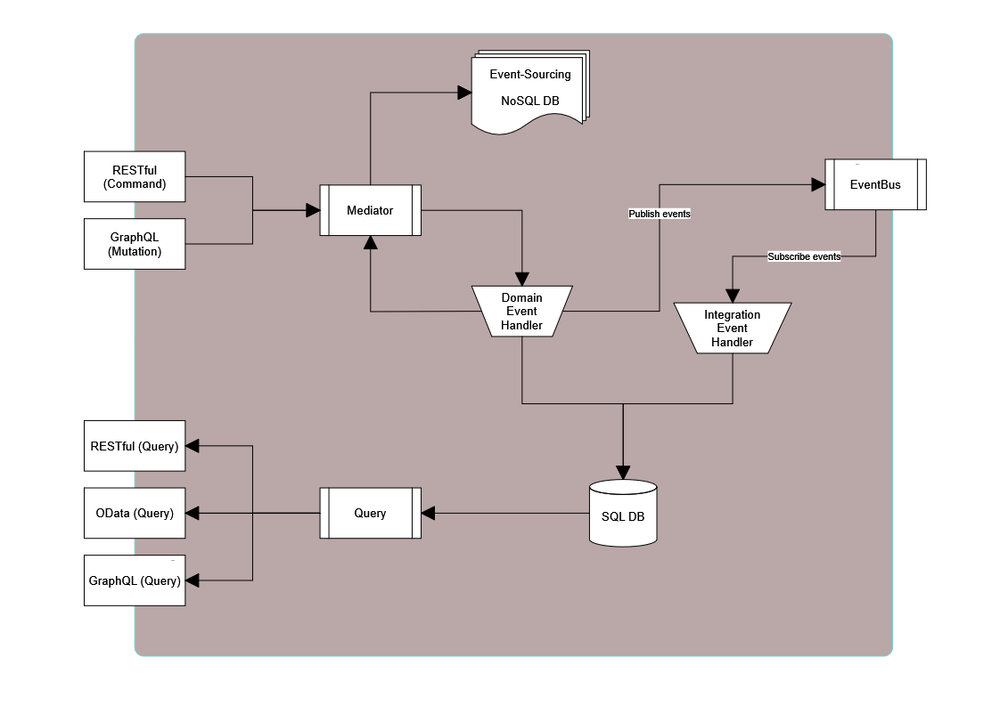

# **Newmoon**

This is a technology proven project that is updated frequently and constantly to catch up all cutting-edge technology. The project not only covers all cutting-edge dev, but also includes testing and DevOp concepts, practices. 
 
## Front-end
### [General](./docs/frontend/general.md)  
### [Angular](./docs/frontend/angular.md)  

## Back-end
 ### [.Net Core](./docs/backend/dotnet_core.md)  

The below image demostrats the high level structure for each service.

 ### [Azure](./docs/backend/azure.md)

## Notes:

### [Setup](./docs/setup.md)  
### [Backlog](./docs/backlog.md)

---
[Markdown cheat sheet ](https://github.com/adam-p/markdown-here/wiki/Markdown-Cheatsheet)