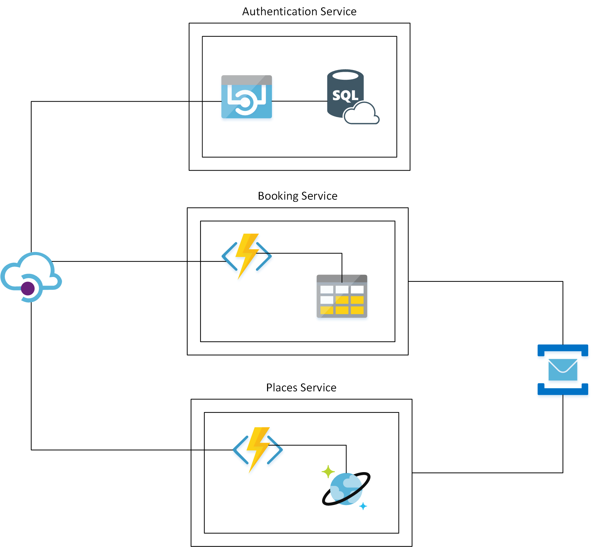

### **Summary** 
Newmoon is an ongoing repeatly rebuilding project with the latest technology and best practices. The idea of the app is simple, a service provides events booking.

The current version focuses on high scalability and high availability on Azure platform. 

It covers the following concept, technology and practice
1) Infrastructure as Code
2) DevOps
3) Serverless
4) Microservice

Instead of using container, I chose serverless as it contains less moving part and lower TCO.

### **Architect** 

### **Repos** 
Shared Resources 
[repo](https://github.com/pingdong/newmoon.shared)  

Authentication 
[repo](https://github.com/pingdong/newmoon.authentication) 

Place Service 
[repo](https://github.com/pingdong/newmoon.places) 

Booking Service 
[repo](https://github.com/pingdong/newmoon.bookings) 

Note: If You're looking for the old container version, please check the [container_2019](https://github.com/pingdong/newmoon/tree/container_2019) branch.
