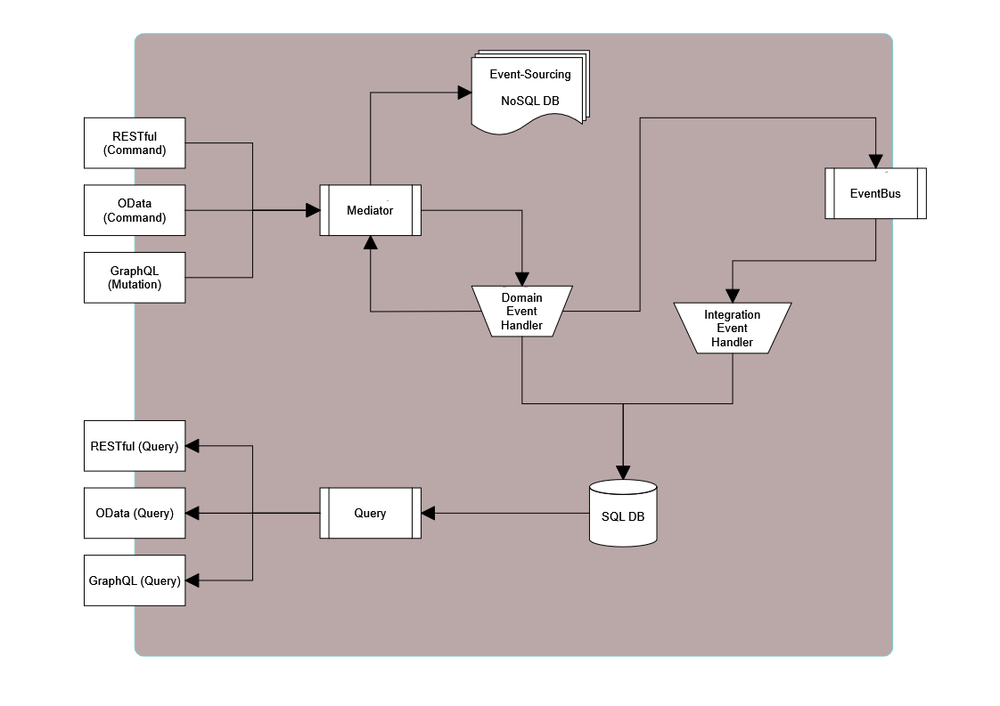

# **Newmoon**

This is a technology proven project that is updated frequently and constantly to catch up all cutting-edge technology. The project not only covers all cutting-edge dev, but also includes testing and DevOp concepts, practices. 
 
The current version borrowed some codes and idea from Microsoft [eShopOnContainers](https://github.com/dotnet-architecture/eShopOnContainers) project, Thanks.
 
The below image suggests the high-level data flow, and an idea of the connection between concepts: CQRS, Mediator, Domain Event, Integration Event, Event Source.

 
In this project, a few advance technology, e.g. Reflection, was used to comply with CoS concept. It may bring some difficulty to understand.

## The following libraries are used:
* [Microsoft ASP.Net Core 2.1.1](https://docs.microsoft.com/en-nz/aspnet/#pivot=core)
* [Microsoft OData 7.0.0](http://odata.github.io/)
* [GraphQL .Net 2.0.0](https://graphql-dotnet.github.io/)
* [StackExchange.Redis 1.2.6](https://github.com/StackExchange/StackExchange.Redis)
* [Dapper 1.50.5](https://github.com/StackExchange/Dapper) ([Tutorial](http://dapper-tutorial.net/dapper))
* [Microsoft Entity Framework Core 2.1.1](https://docs.microsoft.com/en-us/ef/#pivot=efcore)
* [Autofac 4.8.1](https://autofac.org/)
* [AutoMapper 7.0.1](https://automapper.org/)
* [FluentValidation 8.0.0](https://fluentvalidation.net/)
* [MediatR 5.1.0](https://github.com/jbogard/MediatR)
* [Serilog.AspNetCore 2.1.1](https://serilog.net/)
* [Polly 6.0.1](http://www.thepollyproject.org/)
* [NCrontab 3.3.0](https://github.com/atifaziz/NCrontab)
* [Swashbuckle.AspNetCore 3.0.0](https://github.com/domaindrivendev/Swashbuckle.AspNetCore)
* [xUnit.net 2.3.1](https://xunit.github.io/)
* [Moq 4.9.0](https://github.com/moq/moq4)
* [Docker 18.06.0](https://www.docker.com/)

## The following design patterns are involved:
* Clean Architect (aka Onion Architect)
* [Mediator](https://en.wikipedia.org/wiki/Mediator_pattern)
* [CQRS](https://martinfowler.com/bliki/CQRS.html)
* [BoundedContext](https://martinfowler.com/bliki/BoundedContext.html)
* [ValueObject](https://martinfowler.com/bliki/ValueObject.html) (Poor support in EF Core Currently)
* UnitOfWork & Repository

## Other concepts are covered:
* SoC 
* Domain Driven Design 
* Domain Event
* Integration Event 
* Resiliency 
* Idempotency 
* REST vs [GraphQL](http://graphql.github.io/)

## Practices
* Using InMemory Data Provider for testing
*   

> ## Roadmap

  
* [x] Microservice Coding Practice 
* [x] Multiple Configuration Source, Sturcture Application Settings 
* [x] Authentication & Authorization 
* [x] Background Tasks 
* [x] Integration Event

* [x] Cache: In-memory, Redis
* [ ] NoSQL 
  
* [x] OData  
* [x] GraphQL 
* [ ] API Gateway 

* [x] Docker 
* [ ] Kubernetes  

* [ ] ElasticSearch  
* [ ] Grafana or Kibana
* [ ] Prometheus
 
* [ ] Client @ React

* [x] Testing
  * [x] Unit Testing
  * [x] Integration Testing
  * [x] Functional Testing
  * [ ] Performance and Load Testing

> ## Notes:

### [Setup](./docs/Setup.md)  
### [Backlog](./docs/Backlog.md)

### Asp.Net Core   
[Dependency Injection](./docs/IoC.md)  
[Configuration](./docs/Configuration.md)  
[Data Validation](./docs/DataValidation.md)   
[Identity](./docs/Identity.md)    
[HttpClient](./docs/HttpClient.md)  
[Integration Event](./docs/IntegrationEvent.md)  
[Background Tasks](./docs/BackgroundTask.md)

### Data Management  
[Cache](./docs/Cache.md)  
[Mapping](./docs/Mapping.md)  
[EF Core](./docs/EFCore.md)  

### Testing  
[Testing](./docs/Testing.md)  

---
[Markdown cheat sheet ](https://github.com/adam-p/markdown-here/wiki/Markdown-Cheatsheet)