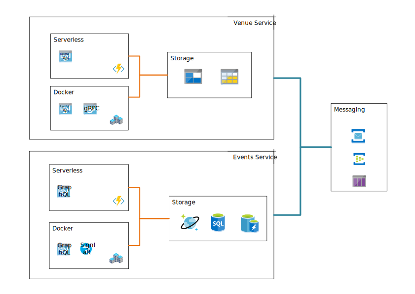

## **Overview** 
Newmoon is an evoluting project with the latest technology and best practices. The idea of the project is a simple service provides event booking.

It covers the following concept, technology and practice
1) Microservice by both Serverless and Docker
2) Test Automation
3) Infrastructure as Code
4) DevOps

---
## **Architecture** 

---
## **Repos** 
* ### ***Infrastructure***
    The [repo](https://github.com/pingdong/newmoon.infrastructure) contains scripts that build infrastructure resources on Azure.  

    **Key Technology:**  
    Terraform, ARM 
 

* ### ***Shared Libary*** 
    The [repo](https://github.com/pingdong/newmoon.shared) contains sharing models, abstractions, extensions and helpers. 
 

* ### ***Authentication Service*** 
    The [repo](https://github.com/pingdong/newmoon.authentication) provides authentication service. 

    **Key Technology:**  
    IdentityServer4 
 

* ### ***Venues Service*** 
    The [repo](https://github.com/pingdong/newmoon.venues) provides venues management service, implemented by both docker and serverless.  

    **Key Technology:**  
    Azure Storage Blob, Azure Storage Table 
    Restful Api, gRpc 
    Azure Service Bus Queue, Azure Storage Queue 
 

* #### ***Events Service*** 
    The [repo](https://github.com/pingdong/newmoon.events) provides events management service, implement by both docker and serverless.

    **Key Technology:**  
    Azure Sql Server, Azure Cosmos Db, Azure Redis 
    GraphQL, SignalR 
    Azure Service Bus Topic/Subscription, Azure Event Hub 
 
