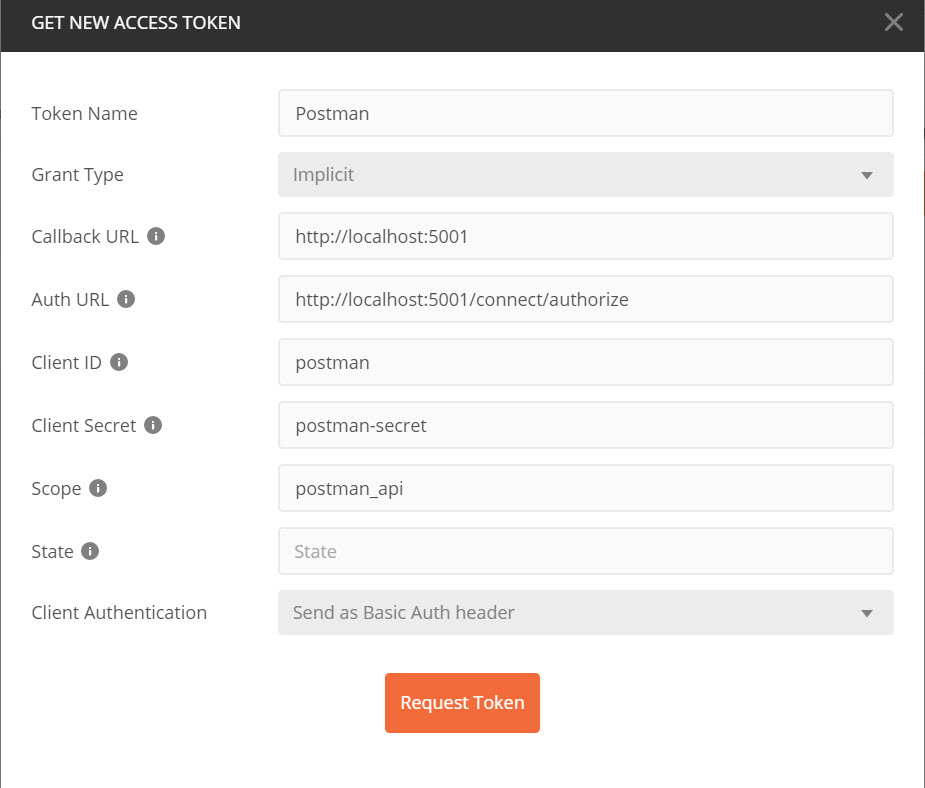

[Back](../README.md)

> ## Identity 

Asp.Net Core Razor Pages project doesn't have a consent page, therefore `RequireConsent` has to be set to false currently in IdentityServer 4 config.

Test using Postman

